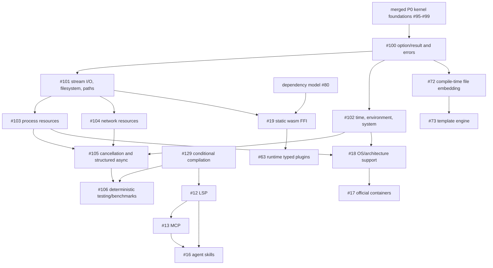

# Open issue roadmap

Snapshot: 2026-07-24. This roadmap orders the open GitHub issues by their
importance to Vibra's language/runtime kernel ("coreness"), their effect on
other work, and whether their acceptance criteria can be verified locally.

## Dependency graph

## Priority queue

| Wave | Issues | Coreness | Rationale / completion gate |
| --- | --- | --- | --- |
| 0 | #100, #101, #102 | kernel | Shared typed failure, I/O, time, environment, and path contracts. Verify the merged host-foundation implementation before adding work. |
| 1 | #103, #104 | kernel host boundary | Depend on reusable I/O and lifecycle contracts; successful operations must return typed resources. |
| 2 | #105, #129, #106 | compiler/runtime architecture | Async/cancellation and deterministic conditional source selection precede representative concurrent testing and benchmarking. `#129` also defines the compilation context consumed by tooling. |
| 3 | #80, #19, #63 | package/ABI architecture | Version solving informs static artifact identity; static FFI informs the common typed-plugin abstraction. |
| 4 | #72, #73 | compiler/product surface | Embedding is the primitive; templating should build on it rather than invent another file-loading path. |
| 5 | #12, #13, #16 | tooling/adoption | LSP semantics and structured CLI/tool schemas precede MCP and comprehensive agent guidance. |
| 6 | #18, #17 | distribution | Platform support and CI matrix precede claims and artifacts for official multi-platform images. |

Within a wave, work is ordered by: blocking edges, security impact,
typed-contract stability, deterministic local testability, then adoption value.

Issue #129 is a high-coreness source-graph concern. It is independent of the
runtime host boundary, but blocks a principled `test` compilation mode and must
be reflected by LSP/compiler invocations. Its initial loader/test foundation is
specified in [conditional-compilation.md](../reference/conditional-compilation.md).

## Completion protocol

For every issue, map each acceptance criterion to code, a focused Rust or
Vibra-language test, and documentation/schema changes where applicable. Run
both `cargo test` and `cargo run -- test`. Only close an issue when every
criterion has evidence; otherwise leave a concise checklist of remaining gaps
and split oversized work into independently testable follow-ups.
